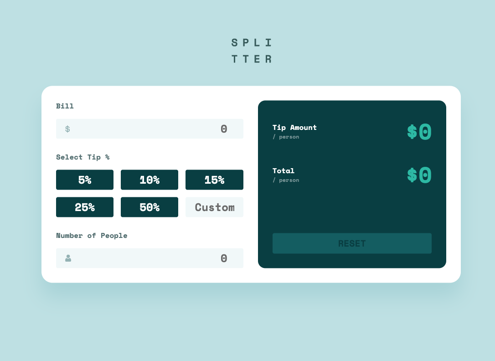

# Frontend Mentor - Tip calculator app solution

This is a solution to the [Tip calculator app challenge on Frontend Mentor](https://www.frontendmentor.io/challenges/tip-calculator-app-ugJNGbJUX). Frontend Mentor challenges help you improve your coding skills by building realistic projects.

## Table of contents

- [Overview](#overview)
  - [The challenge](#the-challenge)
  - [Screenshot](#screenshot)
  - [Links](#links)
- [My process](#my-process)
  - [Built with](#built-with)
  - [What I learned](#what-i-learned)
  - [Continued development](#continued-development)
- [Author](#author)

**Note: Delete this note and update the table of contents based on what sections you keep.**

## Overview

### The challenge

Users should be able to:

- View the optimal layout for the app depending on their device's screen size
- See hover states for all interactive elements on the page
- Calculate the correct tip and total cost of the bill per person

### Screenshot



### Links

- Solution URL: [Add solution URL here](https://your-solution-url.com)
- Live Site URL: [Add live site URL here](https://your-live-site-url.com)

## My process

1. Initialize the svelte project
2. Create the layout
3. Create the calculating part
4. Create the result part
5. Do the desktop layout (everything about was mobile-first)
   6 Add the logic to make it works.

### Built with

- Semantic HTML5 markup
- CSS custom properties
- Flexbox
- CSS Grid
- Mobile-first workflow
- SCSS
- Svelte

### What I learned

Finally understand how derived stores work in svelte.

```js
import { writable, derived } from 'svelte/store';

export const bill = writable(null);
export const tip = writable(null);
export const personNumber = writable(null);

export const tipAmount = derived(
	[bill, tip, personNumber],
	([$bill, $tip, $personNumber]) => {
		return $personNumber === null ? 0 : Number(($bill * $tip) / 100 / $personNumber).toFixed(2);
	},
	0
);

export const total = derived(
	[bill, tip, personNumber],
	([$bill, $tip, $personNumber]) => {
		return $personNumber === null
			? 0
			: Number(($bill * (1 + $tip / 100)) / $personNumber).toFixed(2);
	},
	0
);

export const resetBtnDisabled = derived(
	[bill, tip, personNumber],
	([$tip, $bill, $personNumber]) => $tip === null || $bill === null || $personNumber === null,
	true
);
```

### Continued development

I would like to use this project to learn testing on web projects.

## Author

- Frontend Mentor - [@VicSchbt](https://www.frontendmentor.io/profile/VicSchbt)
- LinkedIn - [Victoire Schubert](www.linkedin.com/in/victoire-schubert)
